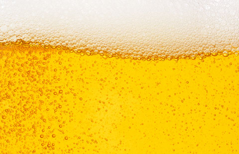

# 🍺 US Alcohol Consumption Explorer

**Author**: Matt Maslow  
**Project Type**: Interactive Shiny App  
**Deployed App**: [Click here to explore!](https://mjmasl01.shinyapps.io/us_alcohol_consumption/)

---

## 🧾 Overview

This was a fun college project built with **R** and **Shiny** that lets users explore alcohol consumption patterns across the United States. Users can interactively visualize per capita consumption of **Beer**, **Wine**, **Spirits**, or **All Types** of alcoholic beverages across time and states.

Depending on your selection, the app dynamically switches between:

- **Bar Plots**: When viewing "All States"
- **Line Graphs**: When selecting individual or multiple states

---

## 📊 Features

- Choose alcohol type: `Beer`, `Wine`, `Spirits`, or `All Types`
- Compare across all 50 states or just a few
- Toggle organization and sorting: by `State` or `Consumption`, in ascending/descending order
- Built with `ggplot2`, `tidyverse`, and `plotly` (optional for later enhancement)

---

## 📁 Files in This Repo

| File | Description |
|------|-------------|
| `app.R` | Full Shiny app code (UI + Server in one file) |
| `Alcohol_Consumption_US.csv` | Cleaned dataset used in the app |
| `beer.jpg` | Optional image asset (used in documentation or future layout) |
| `README.md` | You’re reading it! |

---

## 📷 Preview

---

## 🛠 Tools Used

- **R**  
- **Shiny**  
- **ggplot2**  
- **tidyverse**  
- **dplyr**, **forcats**, **readr**

---

## 🔗 Try It Live

👉 **Launch the app here**:  
https://mjmasl01.shinyapps.io/us_alcohol_consumption/

