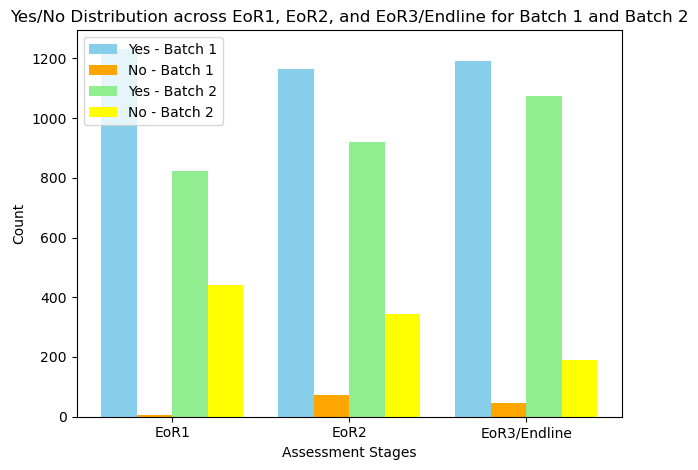

# Dataset Overview

### Preliminary Analysis

- All non-empty fields in the table are categorial features, recording registration status of `student`  from database
- The 2500 data are divided into 2 batches, we can see from the graph that the end of round responses from batches are slightly different, hopefully we can utilize more data or information to analyze the reason.
  
    
    

### Dataset Overview

- Prior key to database: `ChildrenId/ ChildId`
- Columns
    - `ChildID`
    - `DeleteReasonId`
    - `DeleteReason`
      
        ```markdown
        Id - reason: count
        0 - NaN: 958
        1 - Transferred: 7
        2 - Drop Out: 88
        6 - Error Input: 86
        14 - Graduated: 67
        15 - Duplicate: 12
        ```
        
    - `CreatedOn`
        - data created from `2023-01-31` to `2023-09-21`
    - `AcademicYearFull`
      
        ```markdown
        2023-Sarangani-Batch 2-Cycle 1: 1263
        2023-Sarangani-Batch 1-Cycle 1: 1237
        ```
        
    - `Batch`
      
        ```markdown
        Batch 2    1263
        Batch 1    1237
        ```
        
    - `AcademicYear`
        - all data collected for 2023
    - `AcademicYearId`
      
        ```markdown
        7: 1263 (Batch2)
        6: 1237 (Batch1)
        ```
        
    - `AcademicTermDetailsId`
        - 101 different ids, but not specified in the sample dataset
    - `SchoolID`
        - 101 different ids, but not specified in the sample dataset
    - `ClassID`
        - 268 different classes
    - `CuCStatus`
      
        ```markdown
        True     2491
        False       9
        ```
        
    - `IsActiveChildrenAcademicTable`
      
        ```markdown
        True     2240
        False     260
        ```
        
    - `CreatedOn_Child_Academic_Table`
      
        ```markdown
        2023-05-08    1139
        2023-02-06     651
        2023-02-05     416
        2023-02-04     184
        2023-05-15      78
        2023-01-31      24
        2023-02-08       3
        2023-04-02       2
        2023-08-09       1
        2023-09-21       1
        2023-02-02       1
        ```
        
    - `ModifiedOn_Child_Academic_Table`
      
        ```markdown
        2023-04-08    263
        2023-02-18    137
        2023-04-09    135
        2023-04-20    102
        2023-05-02     78
        2023-07-27     73
        2023-02-04     58
        2023-05-15     26
        2023-05-10     24
        2023-04-24     23
        2023-02-19     15
        2023-02-17     11
        2023-02-08      3
        2023-08-01      3
        2023-02-05      2
        2023-02-20      2
        2023-04-02      1
        2023-05-21      1
        2023-08-09      1
        ```
        
    - `IsActiveChildTable`
        - `True` for all 2500 data
    - `CreatedOn_Child_Table`
      
        ```markdown
        2023-05-08    1165
        2023-02-06     652
        2023-02-05     414
        2023-02-04     167
        2023-05-15      52
        2023-01-31      43
        2023-02-08       3
        2023-04-02       2
        2023-09-21       1
        2023-02-02       1
        ```
        
    - `ModifiedOn_Child_Table`
      
        ```markdown
        2023-02-04    116
        2023-02-05     68
        2023-05-15     52
        2023-05-08     43
        2023-02-06     33
        ```
        
    - `Cycle`
        - `Cycle 1`  for all 2500 data
    - `EoR1`
      
        ```markdown
        Yes    2054
        No      446
        ```
        
    - `EoR2`
      
        ```markdown
        Yes    2085
        No      415
        ```
        
    - `EoR3/Endline`
      
        ```markdown
        Yes    2264
        No      236
        ```
        
    - `IsActiveClass`
        - `True`  for all 2500 data
    - `IsActiveSchool`
      
        ```markdown
        True     2474
        False      26
        ```
        
    - `IsActiveChildTable - Copy`
        - `True`  for all 2500 data
    - `IsCurrentChildrenAcademicTable`
      
        ```markdown
        True     2469
        False      31
        ```
        
    - `IsActiveChildrenAcademicTable - Copy`
      
        ```markdown
        True     2240
        False     260
        ```
        
    - `Term`
        - `1` for all 2500 data
    - `FirstName`
        - NaN value
    - `LastName`
        - NaN value
    - `FullName`
        - NaN value
    - `DistrictName`
        - NaN value
    - `StateName`
        - NaN value
    - `ProjectName`
        - NaN value
    - `Grade`
        - NaN value
    - `Age`
        - NaN value
    - `ClassName`
        - NaN value
    - `SchoolName`
        - NaN value
    - `Gender`
        - NaN value